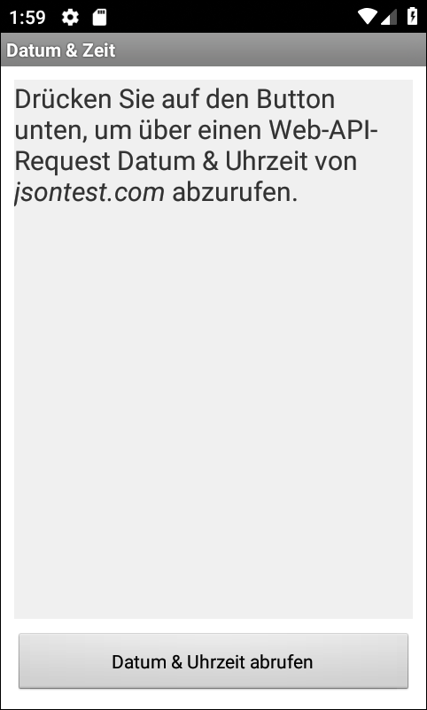
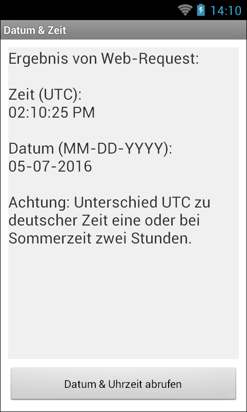

# Android-App "Zeit & Datum von Web-API"

Simple Android app that fetches time and date from a Web API provided by [jsontest.com](http://www.jsontest.com/#date).

URL / endpoint that is queried: http://time.jsontest.com

The author of this app is *NOT* related to the developer/provider of [jsontest.com](http://www.jsontest.com/).

Identifiers (names for classes, variables and methods), UI text and (JavaDoc) comments are in German only.

----
## Screenshots

  

 

The screenshots were taken from emulator.

 

----
# License

See the [LICENSE file](LICENSE.md) for license rights and limitations (BSD 3-Clause License).
