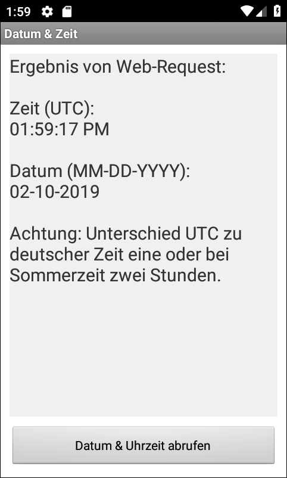

# Android-App "Zeit & Datum von Web-API"

Simple Android app that fetches time and date from a Web API provided by [jsontest.com](http://www.jsontest.com/#date).

The author of this app is not related to the developer/provider of [jsontest.com](http://www.jsontest.com/).

----
## Screenshots

  

 

----
# License

See the [LICENSE file](LICENSE.md) for license rights and limitations (BSD 3-Clause License).
